<div align="center">

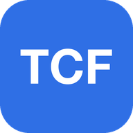

# clean-tcf

**开源的 TCF Canada 备考训练框架。**<br>
听力 · 阅读 · 口语 · 写作 —— 答案出处、逐选项解析、FSRS 记忆闪卡，可以离线用。

[](LICENSE)


**简体中文** · [English](README.en.md)

[**在线试用**](https://clean-tcf-demo.kalebguo.workers.dev) · [快速开始](#快速开始) · [功能](#功能) · [用自己的题库](#用自己的题库) · [给小组部署](#给小组部署可选) · [**托管版本（免费）**](#托管版本免费)

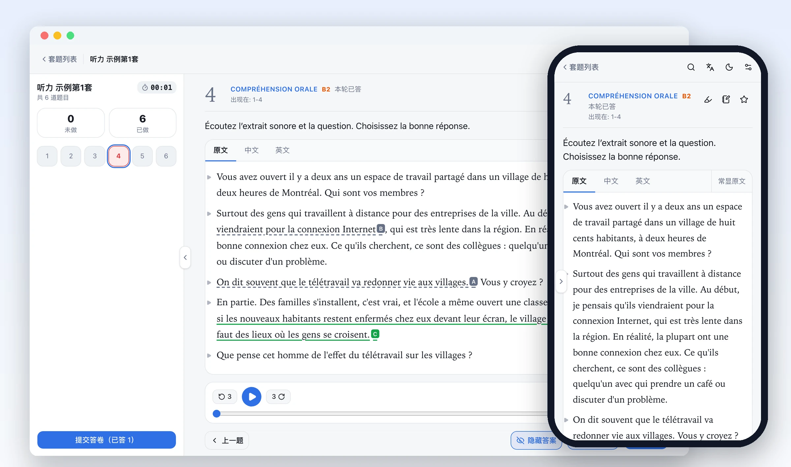

</div>

> [!IMPORTANT]
> 本仓库**只有代码和自编的示例题**，不含任何 TCF 真题、录音、原文或答案。题库由你自己提供（Anki 卡组或 JSON 文件）。

> [!TIP]
> **想直接用完整题库？** 托管版本**免费**，带完整题库，每题都有译文和逐选项解析。[查看详情](#托管版本免费)，或直接发邮件到 [kalebguo@gmail.com](mailto:kalebguo@gmail.com?subject=%E7%94%B3%E8%AF%B7%20clean-tcf%20%E6%89%98%E7%AE%A1%E7%89%88%E6%9C%AC)。

## 适合谁

- 目标是 **NCLC 7 及以上**的考生。NCLC 7 要求听力 458 分、阅读 453 分以上。
- 每天练习、每道错题都要弄懂的人，不只看分数。
- 用自己的题库时，需要会运行 `npm` 命令。在线示例和托管版本不需要安装。

**界面语言：** 简体中文。听力原文和阅读原文有法语、中文、英文三种视图。词典有中文、英文、法文释义。

## 托管版本（免费）

不想自己整理题库？我部署了一份完整版本，**免费**给认真备考的人用，最多 50 人。

| | |
|---|---|
| **完整题库** | 听力和阅读，每题都有逐句译文、答案出处和逐选项解析 |
| 口语、写作 | 口语和写作题库，按 Tâche 和月份整理 |
| 不用安装 | 电脑、手机都能用，可以添加到主屏幕，离线也能练 |
| 记录同步 | 白名单邮箱登录，作答记录和闪卡在多台设备之间同步 |

**申请方法：发邮件到 [kalebguo@gmail.com](mailto:kalebguo@gmail.com?subject=%E7%94%B3%E8%AF%B7%20clean-tcf%20%E6%89%98%E7%AE%A1%E7%89%88%E6%9C%AC)**，写明：

1. 最近一次 TCF 或模考的听力、阅读分数。
2. 目标 NCLC 等级，计划哪个月考试。
3. 每周能练习几个小时。
4. 是否愿意报告题目和解析里的错误（每道题都有「报错」按钮）。

## 功能

<table>
<tr>
<td width="50%">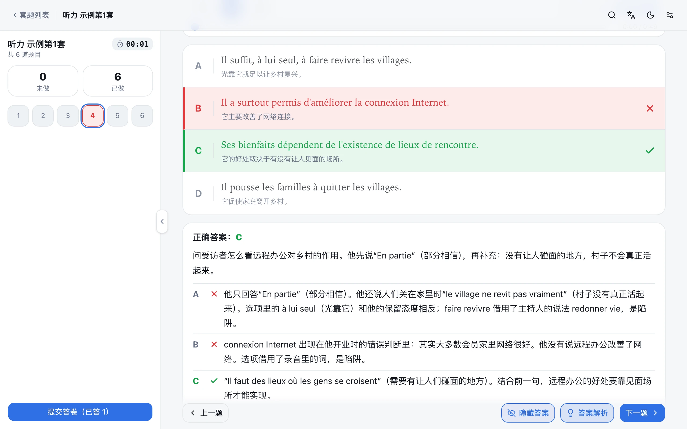<br><b>答案出处和逐选项解析。</b> 作答后，原文里标出每个选项对应的句子。每个选项一条理由。</td>
<td width="50%">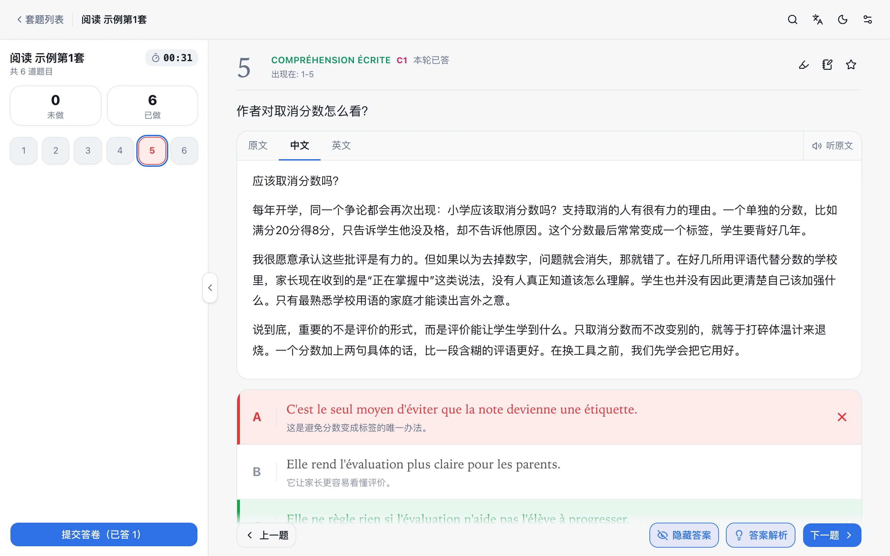<br><b>逐句译文。</b> 原文可以在法语、中文、英文之间切换。</td>
</tr>
<tr>
<td>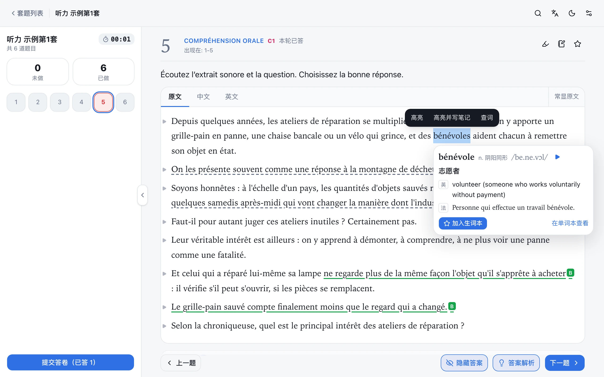<br><b>双击查词。</b> 显示原形、音标、释义和发音。连同原句一起加入生词本。</td>
<td>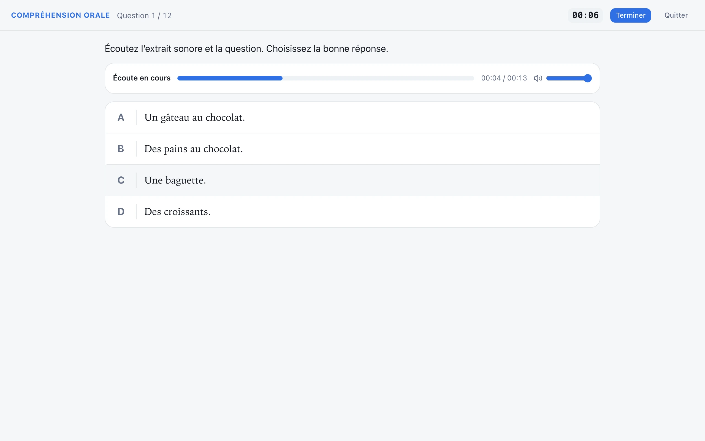<br><b>计时模拟考试。</b> 39 题，A1 到 C2。每段录音只放一次，到点自动交卷，按 699 分制算分，给出 NCLC 等级。</td>
</tr>
<tr>
<td>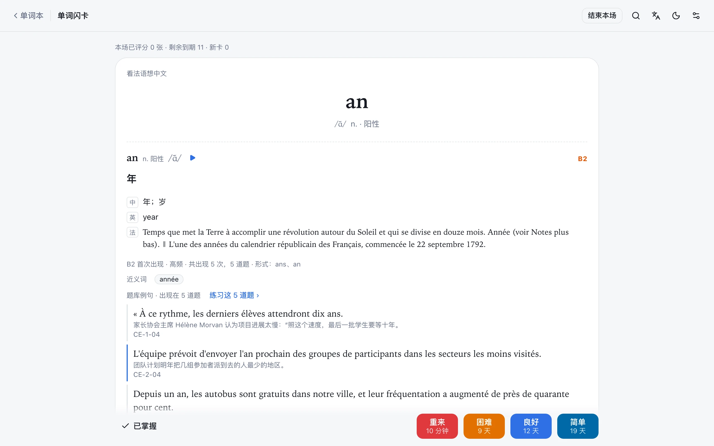<br><b>FSRS 记忆闪卡。</b> 题目卡和单词卡分开。单词卡有 7 种模式，包括拼写和听写。</td>
<td>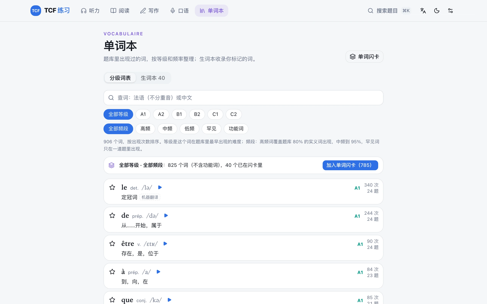<br><b>分级词表。</b> 按你自己题库的词频和等级生成。可以整组加入闪卡。</td>
</tr>
<tr>
<td>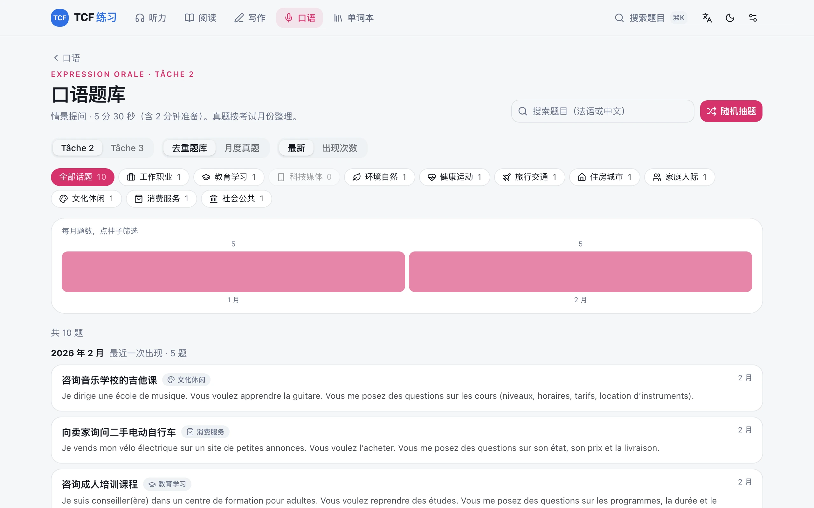<br><b>口语、写作题库。</b> 按 Tâche 和月份浏览，按话题筛选，随机抽题。</td>
<td>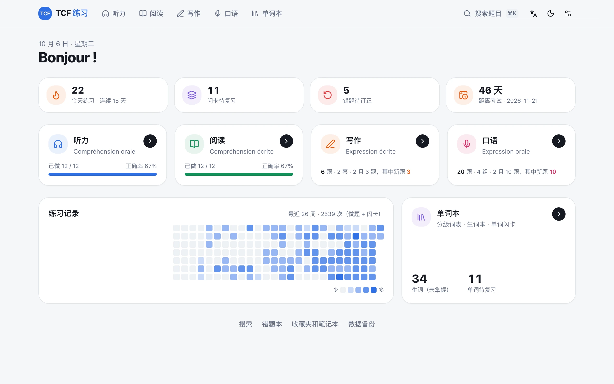<br><b>每日概览。</b> 今天练习量、连续天数、待复习闪卡、待订正错题、距离考试天数、26 周练习记录。</td>
</tr>
<tr>
<td>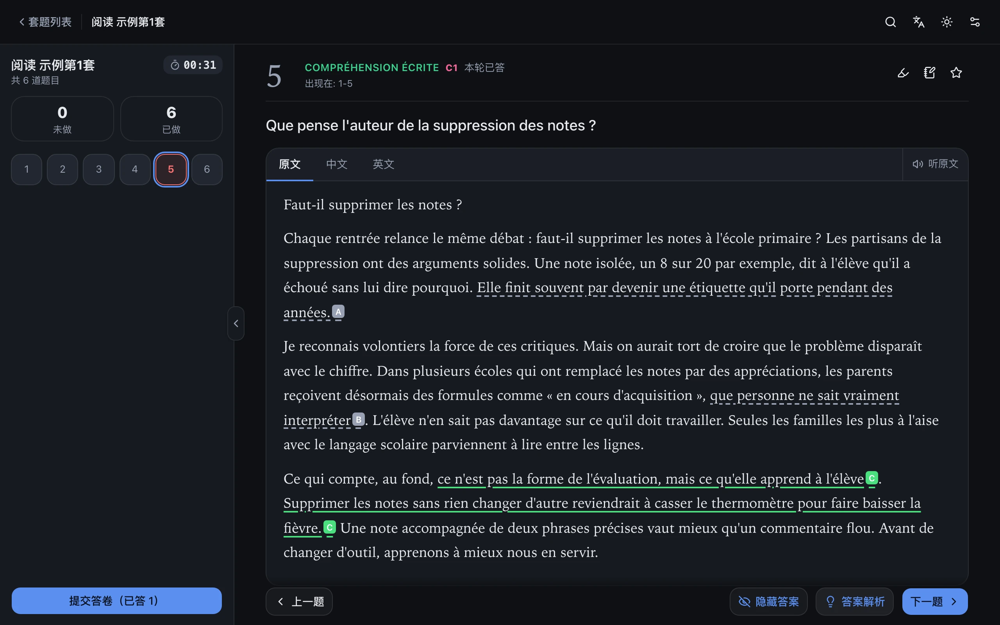<br><b>深色模式</b>和键盘快捷键。</td>
<td><br><b>手机可用。</b> 部署后可以「添加到主屏幕」，文字数据全部离线缓存，音频按等级下载。</td>
</tr>
</table>

**其他功能**

| | |
|---|---|
| 练习方式 | 按难度去重练习、按套练习、只练错题、只练收藏、练搜索结果 |
| 听力工具 | 原文默认模糊，点击才显示；倍速；±3 秒；单句重播 |
| 阅读工具 | 朗读音频，高亮正在读的词；点一个词，从那里开始播放 |
| 笔记 | 任意文字可以高亮、写笔记；收藏和笔记有单独的页面 |
| 错题本 | 答错自动收录；之后答对，自动标为「已订正」 |
| 搜索 | 搜索整个题库（⌘K） |
| 隐私 | 所有记录只存在你的浏览器里（IndexedDB）。不开云同步，就没有数据离开你的设备 |
| 云同步（可选） | 部署到 Cloudflare，白名单邮箱登录，每人一份记录，多设备合并 |

## 快速开始

不想安装？直接打开**[在线示例](https://clean-tcf-demo.kalebguo.workers.dev)**，不用登录，作答记录只存在你的浏览器里。

也可以在本机运行示例题库。示例题全部是为本项目自编的，不是真题。

| 分区 | 示例内容 |
|---|---|
| 听力 | 2 套，每套 6 题（A1–C2）。录音用 macOS 自带的法语语音生成，带时间轴 |
| 阅读 | 2 套，每套 6 题（A1–C2），带朗读音频 |
| 口语 | Tâche 2、Tâche 3 各 2 组，每组 5 个题目 |
| 写作 | 2 套，每套 Tâche 1–3 |

听力和阅读的 24 题都有逐句译文、答案出处和逐选项解析。

1. 安装 Node.js 22 或更新版本。
2. 运行：

   ```bash
   git clone https://github.com/kalebguo/clean-tcf.git
   cd clean-tcf
   npm install
   npm run demo
   ```

3. 打开 http://localhost:5173 。

`npm run demo` 把 `demo/public/` 复制到 `public/`。`public/` 里已经有你自己的题库时，它停下，不改任何文件。

## 工作原理

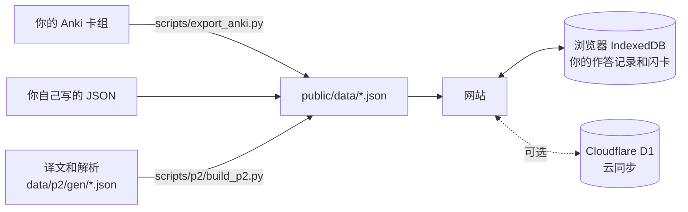

## 用自己的题库

<details>
<summary><b>方式 1：自己写 JSON</b></summary>

把题目写进 `public/data/listening.json`（听力）和 `public/data/reading.json`（阅读）：

```jsonc
{
  "questions": [
    {
      "id": "CO-1-01",            // 唯一编号：分区-套号-题号
      "section": "CO",            // CO 听力，CE 阅读
      "level": "A1",              // A1–C2
      "points": 3,                // A1 3、A2 9、B1 15、B2 21、C1 26、C2 33
      "source": "main",           // main 或 extra
      "bankNo": 1,
      "appearances": [{ "set": "1", "num": 1 }],
      "options": ["…", "…", "…", "…"],
      "answer": "B",
      "audio": "CO_01_Q01.mp3",   // 放在 public/media/
      "image": "CO_01_Q01.jpg",   // 可选
      "transcript": ["…"],        // 听力原文，可选
      "question": "…",            // 阅读题干
      "passage": ["…"]            // 阅读原文
    }
  ],
  "sets": [
    { "section": "CO", "id": "1", "label": "第1套", "series": [], "complete": true, "questionIds": ["CO-1-01"] }
  ]
}
```

完整的字段定义在 [`src/data/types.ts`](src/data/types.ts)。

</details>

<details>
<summary><b>方式 2：从 Anki 导入</b></summary>

导入脚本读取下面两种笔记类型：

| 笔记类型 | 字段 |
|---|---|
| `CO_TCFCA`（听力） | Options, Audio, Image, Transcription, Answer, Analyze, Test, Series, Number, Points |
| `CE_TCFCA`（阅读） | Question, Options, Series, Number, Points, Answer, Analyze, Test, Qphrase |

1. 准备 Python 环境：

   ```bash
   python3 -m venv .venv
   .venv/bin/pip install spacy simplemma mlx-vlm pillow
   .venv/bin/python -m spacy download fr_core_news_md
   ```

2. 运行 `npm run data`。脚本只读 Anki 数据库的拷贝，Anki 开着也可以。
3. 阅读题只有图片时，脚本在本机做 OCR：macOS Vision 和 PaddleOCR-VL 各识别一遍，再合并。PaddleOCR-VL 模型约 1.1 GB，第一次运行时自动下载。OCR 只能在 Apple Silicon 的 Mac 上运行。

可选：把一个法语词形表（每行一个词）放在仓库的上一级目录，文件名见 `scripts/vocab_mapreduce.py` 的 `WORDLIST`。没有它时，用 simplemma 判断一个词是否存在。

</details>

<details>
<summary><b>可选：译文、答案出处和解析</b></summary>

每道题写一个文件 `data/p2/gen/<id>.json`，然后运行 `npm run p2`。格式见 [`demo/src/gen/`](demo/src/gen) 里的 24 个示例。构建前用 `scripts/p2/validate_gen.py` 检查文件。

</details>

## 给小组部署（可选）

用 Cloudflare 免费套餐，最多 50 人。只有白名单上的邮箱能打开网站。

<details>
<summary><b>步骤</b></summary>

1. 注册 Cloudflare，运行 `npx wrangler login`。
2. 运行 `npx wrangler d1 create tcf-sync`，把输出的 `database_id` 填进 `wrangler.jsonc`。
3. 运行 `npx wrangler d1 migrations apply tcf-sync --remote`。
4. 先部署一个空白占位页，不含题库。Worker 存在之后，才能给它开 Access：

   ```bash
   mkdir -p dist-web && echo "建设中" > dist-web/index.html
   npx wrangler deploy
   ```

5. 在 Cloudflare 后台打开 **Workers & Pages** → 你的 Worker → **Access**，开启 **All traffic**，加入白名单邮箱，登录有效期选 **1 month**。
6. 打开网站。网站跳转到 `xxx.cloudflareaccess.com/…?kid=…`：`xxx.cloudflareaccess.com` 是团队域名，`kid` 的值是 AUD。把这两个值填进 `wrangler.jsonc`。
7. 运行 `node scripts/deploy/web.mjs`。

> [!WARNING]
> 没开 Access 就部署，你的题库会对所有人公开。所以第 6 步的两个值没填时，部署脚本拒绝上传。

部署前确认：你有权把题库给小组里的人使用。

设计细节（同步规则、离线缓存、数据库表）见 [`docs/cloud.md`](docs/cloud.md)。

</details>

## 常见问题

<details>
<summary><b>为什么没有真题？</b></summary>

TCF 题目的版权属于出题方和出版方。本项目只公开练习工具。包含考试内容的 Pull Request 会被关闭。

</details>

<details>
<summary><b>我的数据会离开我的设备吗？</b></summary>

不会。作答、闪卡、笔记和高亮都存在你的浏览器里。只有你自己部署并开启云同步时，数据才会上传，而且只传到你自己的 Cloudflare 账号。「数据备份」页可以把所有记录导出成 JSON 文件。

</details>

<details>
<summary><b>有英文界面吗？</b></summary>

还没有。界面是中文的。听力原文、阅读原文和词典已经有英文。欢迎提交英文界面的 Pull Request。

</details>

## 参与开发

欢迎提交 Issue 和 Pull Request。

- 不能包含任何考试内容，测试数据也不行。测试只用自编的句子。
- 提交前运行 `npm run typecheck` 和 `npm test`。
- 界面文字用短句，一句话只说一件事。

## 致谢

- 练习模式和页面布局参考了 [BonTCF](https://www.bontcf.com/)（TCF Canada 备考平台）。本项目和 BonTCF 没有任何关系，没有使用它的代码或数据。

## 许可

- 代码：[MIT](LICENSE)。
- `demo/` 里的示例题是为本项目自编的，也按 MIT 发布。
- 示例词典（`demo/public/data/p2/dict.json`）由 `scripts/p2/build_dict.py` 从维基词典数据（经 kaikki.org）生成，按 CC BY-SA 4.0 发布。
- MIT 许可不包括任何考试内容（题目、录音、文档、原文、译文、解析）。本仓库不分发这些内容。
- 本项目和 France Éducation international（TCF 的主办方）没有任何关系。TCF 是其注册商标。
