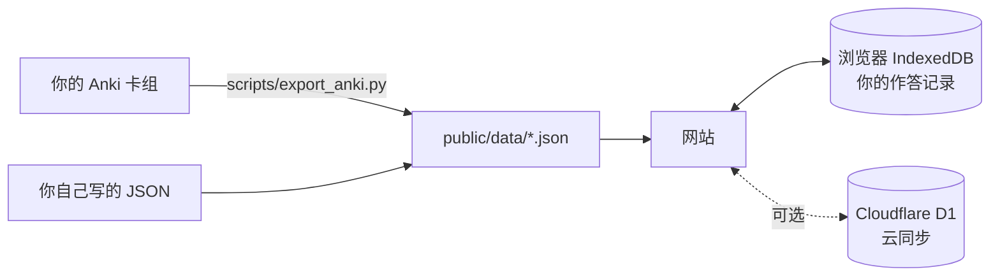

# clean-tcf

**自带题库的 TCF Canada 训练框架：听力、阅读、口语、写作。** 本仓库只有代码和自编的示例题，不含任何真题。

> **English.** An open-source practice app for TCF Canada — listening (CO), reading (CE), plus speaking and writing prompt banks: timed mock exams, a wrong-answer book, FSRS flashcards, a frequency-graded word list, offline use and optional cloud sync for a small invited group. It ships **no exam content**: you bring your own question bank (Anki deck or JSON). The interface is in Chinese.

---

## 这个项目适合谁

适合：

- 目标是 **NCLC 7 及以上**的考生。NCLC 7 要求听力 458 分、阅读 453 分以上。
- 已经有自己的题库（例如 Anki 卡组），或者愿意自己整理题库。
- 每天练习，并且想系统地复盘错题和生词。
- 会运行 `npm` 命令，或者身边有人会。

不适合：

- 想下载免费题库的人。本仓库没有题目，以后也不会有。
- 只想看答案、不想复盘的人。这个工具的重点是错题本、闪卡和逐选项解析。

## 能做什么

| 功能 | 说明 |
|---|---|
| 去重练习 | 按难度（A1–C2）练习，同一题只出现一次 |
| 按套练习、模拟考试 | 39 题一套，按真实考试计时，到点自动交卷，按 699 分制算分 |
| 错题本 | 答错自动收录，再答对自动标为「已订正」 |
| 记忆闪卡 | 用 FSRS 算法安排复习；题目卡和单词卡分开，每天新卡上限分开设 |
| 单词闪卡 | 7 种模式：认词、四选一、听音、回想、例句填空、拼写、听写 |
| 分级词表 | 按题库词频统计，按难度和频段整组加入闪卡 |
| 口语、写作题库 | 按 Tâche 和月份浏览题目，按话题筛选，随机抽题 |
| 练习页 | 原文默认模糊；倍速播放、±3 秒；划词高亮和笔记；双击查词 |
| 译文和解析 | 有对应数据时，显示逐句译文、答案出处高亮、逐选项解析 |
| 离线使用 | 文字数据预先缓存；音频按等级下载；手机上可以「添加到主屏幕」 |
| 云同步（可选） | 自己部署到 Cloudflare，白名单邮箱登录，每人一份记录，多设备合并 |

所有记录默认只存在浏览器里（IndexedDB）。不开云同步，就没有任何数据离开你的设备。

## 不包含什么

下面的内容**不在**本仓库里，也不接受包含它们的 Pull Request：

- 题目、选项、答案、听力音频、阅读图片。
- 听力原文和阅读原文。
- 基于题目生成的译文、解析和答案出处。

原因：TCF 题目的版权属于出题方和出版方。本仓库只公开练习工具。

## 结构



## 快速开始（示例数据）

示例数据全部是为本项目自编的题，只用来试用界面，不是真题：

| 分区 | 示例 |
|---|---|
| 听力 | 2 套，每套 6 题（A1–C2 各 1 题）。录音用 macOS 自带的法语语音生成 |
| 阅读 | 2 套，每套 6 题（A1–C2 各 1 题） |
| 口语 | Tâche 2、Tâche 3 各 2 组，每组 5 个题目 |
| 写作 | 2 套，每套 Tâche 1–3 |

听力和阅读的 24 题都带逐句译文、答案出处和逐选项解析。真实考试每套 39 题，示例每套只有 6 题。

1. 安装 Node.js 22 或更新版本。
2. 运行下面的命令：

   ```bash
   git clone https://github.com/kalebguo/clean-tcf.git
   cd clean-tcf
   npm install
   npm run demo
   ```

3. 打开 http://localhost:5173 。

`npm run demo` 把 `demo/public/` 复制到 `public/`。`public/` 里已经有你自己的题库时，它不会覆盖。

## 用你自己的题库

有两种方式。

### 方式 1：自己写 JSON

把题目写成两个文件：`public/data/listening.json`（听力）和 `public/data/reading.json`（阅读）。格式：

```jsonc
{
  "questions": [
    {
      "id": "CO-1-01",            // 唯一编号：分区-套号-题号
      "section": "CO",            // CO 听力，CE 阅读
      "level": "A1",              // A1–C2
      "points": 3,                // 分值：A1 3、A2 9、B1 15、B2 21、C1 26、C2 33
      "source": "main",           // main 真题，extra 补充题
      "bankNo": 1,
      "appearances": [{ "set": "1", "num": 1 }],   // 出现在哪套的第几题
      "options": ["…", "…", "…", "…"],
      "answer": "B",
      "audio": "CO_01_Q01.mp3",   // 放在 public/media/
      "image": "CO_01_Q01.jpg",   // 可选
      "transcript": ["…"],        // 听力原文，可选
      "question": "…",            // 阅读题干
      "passage": ["…"]            // 阅读原文
    }
  ],
  "sets": [
    { "section": "CO", "id": "1", "label": "第1套", "series": [], "complete": true, "questionIds": ["CO-1-01"] }
  ]
}
```

完整的字段定义在 [`src/data/types.ts`](src/data/types.ts)。

### 方式 2：从 Anki 导入

如果你的卡组用下面两种笔记类型，可以直接导入：

| 笔记类型 | 字段 |
|---|---|
| `CO_TCFCA`（听力） | Options, Audio, Image, Transcription, Answer, Analyze, Test, Series, Number, Points |
| `CE_TCFCA`（阅读） | Question, Options, Series, Number, Points, Answer, Analyze, Test, Qphrase |

1. 准备 Python 环境：

   ```bash
   python3 -m venv .venv
   .venv/bin/pip install spacy simplemma mlx-vlm pillow
   .venv/bin/python -m spacy download fr_core_news_md
   ```

2. 运行 `npm run data`。脚本只读 Anki 数据库的拷贝，Anki 开着也可以。
   - 可选：把一个法语词形表（每行一个词）放在仓库的上一级目录，文件名见 `scripts/vocab_mapreduce.py` 的 `WORDLIST`。没有它时，只用 simplemma 判断一个词是否存在。
3. 阅读题只有图片时，脚本会在本机做 OCR：macOS Vision 和 PaddleOCR-VL 各识别一遍，再合并。PaddleOCR-VL 模型约 1.1 GB，第一次运行时自动下载。OCR 只能在 Apple Silicon 的 Mac 上运行。

## 给小组部署（可选）

用 Cloudflare 免费套餐，最多 50 人。只有白名单上的邮箱能打开网站。

1. 注册 Cloudflare，运行 `npx wrangler login`。
2. 运行 `npx wrangler d1 create tcf-sync`，把输出的 `database_id` 填进 `wrangler.jsonc`。
3. 运行 `npx wrangler d1 migrations apply tcf-sync --remote`。
4. 先部署一个空白占位页，不含题库。这一步只是为了让 Worker 存在，下一步才能给它开 Access：

   ```bash
   mkdir -p dist-web && echo "建设中" > dist-web/index.html
   npx wrangler deploy
   ```

5. 在 Cloudflare 后台打开 **Workers & Pages** → 你的 Worker → **Access**，开启 **All traffic**，加入白名单邮箱，登录有效期选 **1 month**。
6. 打开网站。网站跳转到 `xxx.cloudflareaccess.com/…?kid=…`：`xxx.cloudflareaccess.com` 是团队域名，`kid` 的值是 AUD。把这两个值填进 `wrangler.jsonc`。
7. 运行 `node scripts/deploy/web.mjs`。

> **警告**：没开 Access 就部署，你的题库会对所有人公开。所以第 6 步的两个值没填时，部署脚本拒绝上传。

部署前确认：你有权把题库给小组里的人使用。

设计细节（同步规则、离线缓存、数据库表）见 [`docs/cloud.md`](docs/cloud.md)。

## 申请使用我们的托管版本

我自己部署了一份，只给少数认真备考的人用，名额有限（最多 50 人）。

申请时请写明：

1. 现在的水平：最近一次 TCF 或模考的听力、阅读分数。
2. 目标：NCLC 几级，计划哪个月考试。
3. 每周能练习几个小时。
4. 是否愿意报告题目和解析里的错误（页面上有「报错」按钮）。

申请方式：申请表（Google 表单）还没开放。开放后，链接放在这里。

## 参与开发

欢迎提交代码和问题。

- Pull Request 不能包含任何题目内容，包括测试数据。测试只用自编的句子。
- 提交前运行 `npm run typecheck` 和 `npm test`。
- 界面文字用中文，写短句，一句话只说一件事。

## 许可

- 代码：MIT License，见 [LICENSE](LICENSE)。
- `demo/` 里的示例题是为本项目自编的，也按 MIT License 发布。
- 示例词典（`demo/public/data/p2/dict.json`）由 `scripts/p2/build_dict.py` 从维基词典数据（经 kaikki.org）生成，按 CC BY-SA 4.0 发布。
- MIT License 不包括任何考试内容（题目、录音、文档、原文、译文、解析）。本仓库不分发这些内容。
- 本项目和 France Éducation international（TCF 的主办方）没有任何关系。TCF 是其注册商标。
