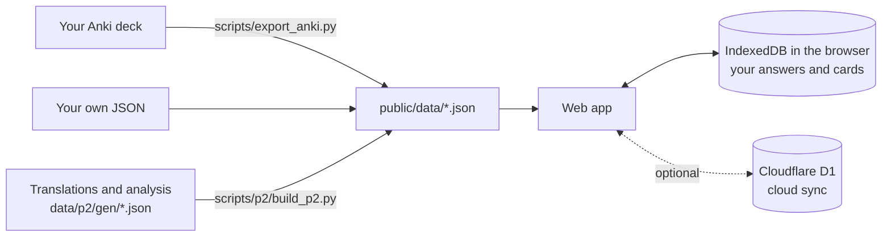

<div align="center">


# clean-tcf

**An open-source practice app for TCF Canada.**<br>
Listening · Reading · Speaking · Writing — with answer evidence, per-option analysis, FSRS flashcards and offline use.

[](LICENSE)


**English** · [简体中文](README.zh-CN.md)

[Quick start](#quick-start) · [Features](#features) · [Your own bank](#use-your-own-question-bank) · [Deploy for a group](#deploy-for-a-group-optional) · [Hosted version](#hosted-version)


</div>

> [!IMPORTANT]
> This repository has **code and invented demo questions only**. It has no TCF questions, recordings, transcripts or answers. You bring your own question bank (an Anki deck or JSON files).

## Who it is for

- Candidates who aim for **NCLC 7 or higher**. NCLC 7 needs 458+ in listening and 453+ in reading.
- Learners who practise every day and review each mistake, not only the score.
- People who can run `npm` commands, or who know someone who can.

**Interface language:** Simplified Chinese. Transcripts and passages have French, Chinese and English views. The dictionary shows Chinese, English and French definitions.

## Features

<table>
<tr>
<td width="50%"><br><b>Evidence and per-option analysis.</b> After you answer, the transcript marks the sentence behind each option. Each option gets one reason.</td>
<td width="50%"><br><b>Sentence-by-sentence translation.</b> Switch the transcript or passage between French, Chinese and English.</td>
</tr>
<tr>
<td><br><b>Double-click a word.</b> See its lemma, IPA, definitions and audio. Add it to your word book with its sentence.</td>
<td><br><b>Timed mock exam.</b> 39 questions from A1 to C2. It plays each recording once, submits on time and gives a score out of 699 with the NCLC level.</td>
</tr>
<tr>
<td><br><b>FSRS flashcards.</b> Separate decks for questions and words. 7 word modes, including spelling and dictation.</td>
<td><br><b>Graded word list.</b> Built from your own bank by frequency and level. Add a whole band to your flashcards.</td>
</tr>
<tr>
<td><br><b>Speaking and writing bank.</b> Browse prompts by Tâche and month, filter by topic, or pick one at random.</td>
<td><br><b>Daily overview.</b> Practice today, streak, cards due, mistakes to fix, days to your exam, and a 26-week heatmap.</td>
</tr>
<tr>
<td><br><b>Dark mode</b> and keyboard shortcuts.</td>
<td><br><b>Phone ready.</b> A deployed copy installs to the home screen, caches all text for offline use and downloads audio by level.</td>
</tr>
</table>

**Also included**

| | |
|---|---|
| Practice modes | By level with no repeats, by set, mistakes only, favourites only, search results |
| Listening tools | Blurred transcript until you choose to see it, speed control, ±3 s, replay one sentence |
| Reading tools | Read-aloud audio that highlights the current word; click a word to start from there |
| Notes | Highlight any text and add a note; notes and favourites have their own page |
| Mistake book | Wrong answers go in automatically; a later correct answer marks them as fixed |
| Search | Search the whole bank (⌘K) |
| Privacy | All records stay in your browser (IndexedDB). Nothing leaves your device unless you turn on cloud sync |
| Cloud sync (optional) | Deploy to Cloudflare, sign in by email whitelist, one record per person, merge across devices |

## Quick start

Try the interface with the demo bank. Every demo question was written for this project.

| Section | Demo content |
|---|---|
| Listening | 2 sets × 6 questions (A1–C2). Audio made with macOS French voices, with a timed transcript |
| Reading | 2 sets × 6 questions (A1–C2), with read-aloud audio |
| Speaking | Tâche 2 and Tâche 3, 2 groups each, 5 prompts per group |
| Writing | 2 sets, Tâche 1–3 each |

All 24 listening and reading questions have translations, answer evidence and per-option analysis.

1. Install Node.js 22 or newer.
2. Run:

   ```bash
   git clone https://github.com/kalebguo/clean-tcf.git
   cd clean-tcf
   npm install
   npm run demo
   ```

3. Open http://localhost:5173.

`npm run demo` copies `demo/public/` to `public/`. If `public/` already has your own bank, it stops and changes nothing.

## How it works



## Use your own question bank

<details>
<summary><b>Option 1: write JSON</b></summary>

Put the questions in `public/data/listening.json` and `public/data/reading.json`:

```jsonc
{
  "questions": [
    {
      "id": "CO-1-01",            // unique: section-set-number
      "section": "CO",            // CO listening, CE reading
      "level": "A1",              // A1–C2
      "points": 3,                // A1 3, A2 9, B1 15, B2 21, C1 26, C2 33
      "source": "main",           // main or extra
      "bankNo": 1,
      "appearances": [{ "set": "1", "num": 1 }],
      "options": ["…", "…", "…", "…"],
      "answer": "B",
      "audio": "CO_01_Q01.mp3",   // in public/media/
      "image": "CO_01_Q01.jpg",   // optional
      "transcript": ["…"],        // listening, optional
      "question": "…",            // reading
      "passage": ["…"]            // reading
    }
  ],
  "sets": [
    { "section": "CO", "id": "1", "label": "Set 1", "series": [], "complete": true, "questionIds": ["CO-1-01"] }
  ]
}
```

All fields are defined in [`src/data/types.ts`](src/data/types.ts).

</details>

<details>
<summary><b>Option 2: import from Anki</b></summary>

The import reads two note types:

| Note type | Fields |
|---|---|
| `CO_TCFCA` (listening) | Options, Audio, Image, Transcription, Answer, Analyze, Test, Series, Number, Points |
| `CE_TCFCA` (reading) | Question, Options, Series, Number, Points, Answer, Analyze, Test, Qphrase |

1. Set up Python:

   ```bash
   python3 -m venv .venv
   .venv/bin/pip install spacy simplemma mlx-vlm pillow
   .venv/bin/python -m spacy download fr_core_news_md
   ```

2. Run `npm run data`. The script reads a copy of the Anki database, so Anki can stay open.
3. Reading questions that exist only as images go through local OCR (macOS Vision and PaddleOCR-VL, then merged). The PaddleOCR-VL model is about 1.1 GB and downloads on the first run. OCR needs an Apple Silicon Mac.

Optional: put a French word-form list (one word per line) in the folder above the repository. See `WORDLIST` in `scripts/vocab_mapreduce.py` for the file name. Without it, simplemma decides whether a word exists.

</details>

<details>
<summary><b>Optional: translations, evidence and analysis</b></summary>

Write one file per question in `data/p2/gen/<id>.json`, then run `npm run p2`. The 24 files in [`demo/src/gen/`](demo/src/gen) show the format. `scripts/p2/validate_gen.py` checks a file before you build.

</details>

## Deploy for a group (optional)

Uses the Cloudflare free plan. Up to 50 people. Only whitelisted email addresses can open the site.

<details>
<summary><b>Steps</b></summary>

1. Create a Cloudflare account and run `npx wrangler login`.
2. Run `npx wrangler d1 create tcf-sync`. Put the `database_id` from the output in `wrangler.jsonc`.
3. Run `npx wrangler d1 migrations apply tcf-sync --remote`.
4. Deploy an empty placeholder page first, without your bank. The Worker must exist before you can put Access in front of it:

   ```bash
   mkdir -p dist-web && echo "Coming soon" > dist-web/index.html
   npx wrangler deploy
   ```

5. In the Cloudflare dashboard, open **Workers & Pages** → your Worker → **Access**. Turn on **All traffic**, add the whitelisted emails and set the session duration to **1 month**.
6. Open the site. It redirects to `xxx.cloudflareaccess.com/…?kid=…`. `xxx.cloudflareaccess.com` is the team domain; the `kid` value is the AUD. Put both in `wrangler.jsonc`.
7. Run `node scripts/deploy/web.mjs`.

> [!WARNING]
> If you deploy without Access, your bank is public. So the deploy script refuses to upload until both values from step 6 are set.

Before you deploy, make sure you have the right to share your bank with the people in your group.

Design details (sync rules, offline cache, database tables): [`docs/cloud.md`](docs/cloud.md).

</details>

## Hosted version

I run one deployment for a small group of serious candidates (50 places at most). To apply, tell me:

1. Your latest listening and reading scores (TCF or mock exam).
2. Your target NCLC level and your exam month.
3. How many hours a week you can practise.
4. Whether you will report errors in questions and analyses (each question has a "report" button).

**The application form (Google Forms) is not open yet. The link will go here.**

## FAQ

<details>
<summary><b>Why are there no real questions?</b></summary>

TCF questions belong to their publishers. This project publishes the practice tool only. Pull requests that add exam content will be closed.

</details>

<details>
<summary><b>Does my data leave my device?</b></summary>

No. Answers, cards, notes and highlights are stored in your browser. They leave the device only if you deploy your own copy with cloud sync, and then only to your own Cloudflare account. The **数据备份** (backup) page exports everything to a JSON file.

</details>

<details>
<summary><b>Is there an English interface?</b></summary>

Not yet. The interface is in Chinese. Transcripts, passages and the dictionary already have English. Pull requests for an English interface are welcome.

</details>

## Contributing

Issues and pull requests are welcome.

- Never include exam content, also not in tests. Tests use invented sentences only.
- Run `npm run typecheck` and `npm test` before you open a pull request.
- Interface text: short sentences, one idea per sentence.

## License

- Code: [MIT](LICENSE).
- The demo questions in `demo/` were written for this project and are also MIT.
- The demo dictionary (`demo/public/data/p2/dict.json`) is built by `scripts/p2/build_dict.py` from Wiktionary data (via kaikki.org) and is licensed CC BY-SA 4.0.
- The MIT license does not cover exam content (questions, recordings, documents, transcripts, translations, analyses). This repository does not distribute any.
- This project is not affiliated with France Éducation international, which runs the TCF. TCF is its registered trademark.
