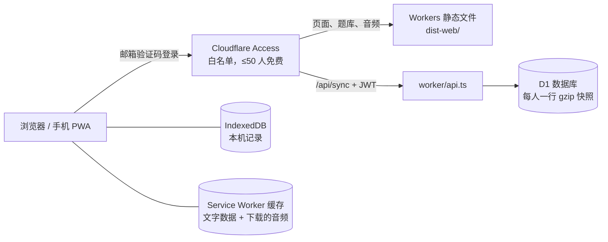
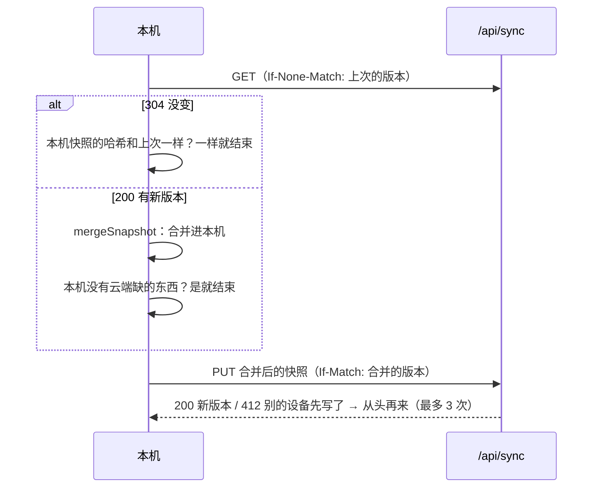

# 云端版：白名单登录、同步、离线

这份文档说明「给小组部署」（README）背后的设计。只在本机用，可以不读。

## 结构

- **登录**：整个域名在 Cloudflare Access 后面。白名单在 Cloudflare 后台改。`worker/api.ts` 用 Access 的公钥验证请求头 `Cf-Access-Jwt-Assertion`，从里面取邮箱。只有请求头、没有有效签名的请求一律拒绝。
- **本地开发**：`wrangler dev` 在 localhost 上运行时，用 `.dev.vars` 里的 `DEV_EMAIL` 作为登录邮箱。
- **存储**：D1 表 `snapshots(email, version, data, bytes, updated_at)`，一人一行。`data` 是 gzip 压缩的 JSON 快照，上限 1.9 MB（D1 一行最多 2 MB）。
- **接口**：

  | 请求 | 结果 |
  |---|---|
  | `GET /api/sync` | 204 没有记录；304 没变（`If-None-Match`）；200 快照 + `ETag: "v<n>"` |
  | `PUT /api/sync` | 带 `If-Match: "v<n>"` 替换第 n 版；不带 `If-Match` 只能建第一版；别的设备先写了返回 412 |
  | `GET /api/me` | 当前登录的邮箱 |
  | `GET /api/login` | 登录过期后整页跳转到这里，重新过 Access，再回到首页 |

## 同步

合并逻辑在 `src/db/sync.ts`，网络部分在 `src/cloud/cloud.ts`。

- 快照 = 备份文件 + 删除记录（`tombstones`）+ 纪元（`epoch`）。
- 有主键的表：`updatedAt` 新的一方赢。只追加的表（作答记录、复习记录、报错）：按内容去重后合并。
- 删除：删除时在同一个事务里写删除记录（`markDeleted`）。删除时间晚于这一行最后修改时间，就删除；本机删过的行，不会被云端的旧行带回来。
- 清空数据、覆盖导入：开始新纪元。纪元新的一方整体覆盖另一方。所以「清空数据」会清空所有设备。
- 同步时机：打开页面；改动后 4 秒（连续改动时最多 30 秒）；页面切到前台或后台；网络恢复；每 5 分钟。
- 换账号：本机记录属于另一个邮箱时，暂停同步。用户确认后清空本机，再下载新账号的记录。
- 已知限制：两台设备离线时改了同一题的状态或同一张闪卡，联网后时间晚的一方覆盖另一方。作答记录和复习记录不会丢。

## 离线

- `scripts/deploy/web.mjs` 用 Workbox 生成 `sw.js`，预缓存网站代码和全部文字数据。第一次打开时在后台下载。
- 音频和图片：用过就缓存（CacheFirst，支持 Range 请求）。音频元素只请求部分内容，部分响应不能缓存，所以播放时 `cloud.ts` 再整份下载一次。
- 「数据」页的「离线使用」：按分区和等级下载音频和图片（清单在 `data/offline.json`），也可以删除。
- 新版本：新的 service worker 进入等待状态，页面顶部提示「更新并刷新」。
- 打开页面时申请持久存储（`navigator.storage.persist()`），减少浏览器自动清理。

## 部署脚本做了什么

`node scripts/deploy/web.mjs`：

1. `vite build`（`vite.web.config.ts`）→ `dist-web/`。
2. 硬链接 `public/data`、题库用到的 `public/media`、`public/media-tts`。跳过 iCloud 生成的副本（「名字 2.json」）。
3. 生成 `data/offline.json`（各等级的媒体文件清单）、manifest、图标和 `sw.js`。
4. 检查 Workers 的限制：最多 20,000 个文件，单个文件最大 25 MiB。
5. `wrangler deploy`。`wrangler.jsonc` 里的 `ACCESS_TEAM_DOMAIN` 和 `ACCESS_AUD` 没填时，拒绝部署。

其他参数：`--stage` 只打包不上传；`--dev` 打包后用本地 D1 在 http://localhost:8787 运行。

`dist-web/`、`.wrangler/`、`.dev.vars` 不提交 git。
